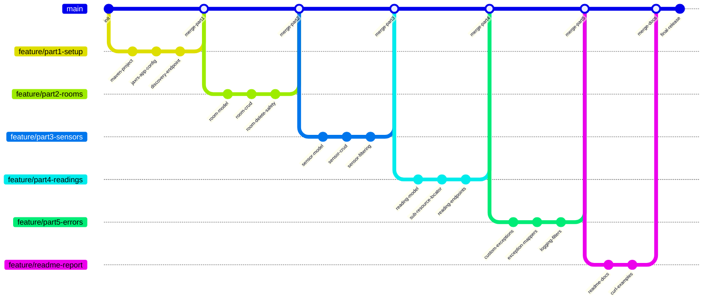

# 🏫 Smart Campus JAX-RS API — 14-Day Implementation Plan

> **Module:** 5COSC022W Client-Server Architectures  
> **Weight:** 60% of final grade  
> **Deadline:** 24th April 2026, 13:00  
> **Today:** 7th April 2026 → **17 calendar days available** (using 14 working days)

---

## 📊 Mark Breakdown Summary

| Part | Topic | Marks | Coding (50%) | Video (30%) | Report (20%) |
|------|-------|-------|-------------|-------------|-------------|
| **Part 1** | Service Architecture & Setup | 10 | 5 | 3 | 2 |
| **Part 2** | Room Management | 20 | 10 | 6 | 4 |
| **Part 3** | Sensor Operations & Linking | 20 | 10 | 6 | 4 |
| **Part 4** | Deep Nesting / Sub-Resources | 20 | 10 | 6 | 4 |
| **Part 5** | Error Handling, Exception Mapping & Logging | 30 | 15 | 9 | 6 |
| **Total** | | **100** | **50** | **30** | **20** |

---

## 🔀 Git Branch Strategy



### Branch List

| Branch | Purpose | Merges Into |
|--------|---------|-------------|
| `main` | Production-ready code (final submission) | — |
| `feature/part1-setup` | Maven project + JAX-RS config + discovery endpoint | `main` |
| `feature/part2-rooms` | Room POJO + CRUD + delete safety logic | `main` |
| `feature/part3-sensors` | Sensor POJO + CRUD + query param filtering | `main` |
| `feature/part4-readings` | SensorReading POJO + sub-resource locator pattern | `main` |
| `feature/part5-errors` | Custom exceptions + exception mappers + logging filters | `main` |
| `feature/readme-report` | README.md with report answers + curl examples | `main` |

---

## 📅 Day-by-Day Plan

### Day 1 (April 8) — Project Bootstrap

**Branch:** `feature/part1-setup`

- [x] Create Maven project with `pom.xml`
- [x] Add dependencies: Jersey (JAX-RS impl), Grizzly/Jetty embedded server, JSON binding (Jackson/MOXy)
- [x] Create main class with embedded server startup
- [x] Create `SmartCampusApplication extends Application` with `@ApplicationPath("/api/v1")`
- [x] Verify server starts and responds on `http://localhost:8080/api/v1`

**Key Files to Create:**
```
src/main/java/
  └── com/smartcampus/
      ├── SmartCampusApplication.java
      └── Main.java
pom.xml
```

**Sample `pom.xml` dependencies:**
```xml
<dependencies>
    <!-- Jersey -->
    <dependency>
        <groupId>org.glassfish.jersey.containers</groupId>
        <artifactId>jersey-container-grizzly2-http</artifactId>
        <version>2.41</version>
    </dependency>
    <dependency>
        <groupId>org.glassfish.jersey.inject</groupId>
        <artifactId>jersey-hk2</artifactId>
        <version>2.41</version>
    </dependency>
    <dependency>
        <groupId>org.glassfish.jersey.media</groupId>
        <artifactId>jersey-media-json-jackson</artifactId>
        <version>2.41</version>
    </dependency>
</dependencies>
```

---

### Day 2 (April 9) — Discovery Endpoint + POJOs

**Branch:** `feature/part1-setup`

- [x] Implement `GET /api/v1` discovery endpoint returning API metadata JSON:
  ```json
  {
    "version": "1.0",
    "name": "Smart Campus API",
    "contact": "admin@smartcampus.ac.uk",
    "resources": {
      "rooms": "/api/v1/rooms",
      "sensors": "/api/v1/sensors"
    }
  }
  ```
- [x] Create all 3 POJO model classes: `Room`, `Sensor`, `SensorReading`
- [x] Implement proper constructors, getters, setters for all models
- [x] Create in-memory data store class using `HashMap`/`ArrayList`
- [x] **Merge `feature/part1-setup` → `main`**

**Key Files:**
```
src/main/java/com/smartcampus/
  ├── resource/DiscoveryResource.java
  ├── model/Room.java
  ├── model/Sensor.java
  ├── model/SensorReading.java
  └── storage/DataStore.java
```

> [!IMPORTANT]
> **Data Store Design:** Use thread-safe `ConcurrentHashMap` since JAX-RS resource classes are per-request by default. The data store must be a **singleton** shared across all requests.

---

### Day 3 (April 10) — Room CRUD Endpoints

**Branch:** `feature/part2-rooms`

- [x] Create `RoomResource` class with `@Path("/rooms")`
- [x] Implement `GET /api/v1/rooms` — return all rooms as JSON list
- [x] Implement `POST /api/v1/rooms` — create a room, return `201 Created` with the room object
- [x] Implement `GET /api/v1/rooms/{roomId}` — return specific room or `404 Not Found`
- [x] Pre-populate DataStore with 2-3 sample rooms for testing

**Endpoint Details:**

| Method | Path | Success Response | Error Response |
|--------|------|-----------------|----------------|
| `GET` | `/rooms` | `200 OK` + JSON array | — |
| `POST` | `/rooms` | `201 Created` + room JSON | `400 Bad Request` |
| `GET` | `/rooms/{roomId}` | `200 OK` + room JSON | `404 Not Found` |

---

### Day 4 (April 11) — Room Delete with Safety Logic

**Branch:** `feature/part2-rooms`

- [x] Implement `DELETE /api/v1/rooms/{roomId}`
- [x] Add **business logic check**: if room has sensors assigned → throw `RoomNotEmptyException` (block deletion)
- [x] If room has no sensors → delete and return `204 No Content`
- [x] If room doesn't exist → return `404 Not Found`
- [x] Test all three scenarios manually
- [x] Implement `PUT /api/v1/rooms/{roomId}` (optional — good practice for full CRUD)
- [x] **Merge `feature/part2-rooms` → `main`**

> [!WARNING]
> The delete safety logic ties directly to **Part 5 (Exception Mappers)** for the 409 Conflict response. For now, just throw the exception — the mapper will be built on Day 9.

---

### Day 5 (April 12) — Sensor CRUD + Room Validation

**Branch:** `feature/part3-sensors`

- [x] Create `SensorResource` class with `@Path("/sensors")`
- [x] Implement `POST /api/v1/sensors`
  - Validate that `roomId` in request body exists in the system
  - If room doesn't exist → throw `LinkedResourceNotFoundException`
  - On success → add sensor ID to the Room's `sensorIds` list + return `201 Created`
- [x] Implement `GET /api/v1/sensors` — return all sensors
- [x] Implement `GET /api/v1/sensors/{sensorId}` — return specific sensor or `404`
- [x] Use `@Consumes(MediaType.APPLICATION_JSON)` and `@Produces(MediaType.APPLICATION_JSON)`

**Linking Logic (Critical):**
```
POST /sensors  →  validate roomId exists
               →  create sensor
               →  add sensor.id to room.sensorIds
```

---

### ✅ DONE: Day 6 (April 13) — Sensor Filtering with @QueryParam

**Branch:** `feature/part3-sensors`

- [x] Enhance `GET /api/v1/sensors` with optional `@QueryParam("type")` filter
  - `GET /api/v1/sensors` → all sensors
  - `GET /api/v1/sensors?type=CO2` → only CO2 sensors
- [x] Implement `DELETE /api/v1/sensors/{sensorId}` — also remove sensor ID from parent Room's `sensorIds`
- [x] Implement `PUT /api/v1/sensors/{sensorId}` — update sensor details
- [x] Test filtering with different sensor types
- [x] **Merge `feature/part3-sensors` → `main`**

---

### Day 7 (April 14) — Sub-Resource Locator for Readings

**Branch:** `feature/part4-readings`

- [x] In `SensorResource`, create a sub-resource locator method:
  ```java
  @Path("{sensorId}/readings")
  public SensorReadingResource getReadings(@PathParam("sensorId") String sensorId) {
      // validate sensor exists
      return new SensorReadingResource(sensorId);
  }
  ```
- [x] Create `SensorReadingResource` class (NOT annotated with `@Path` at class level)
- [x] Store readings in DataStore: `Map<String, List<SensorReading>>`

---

### Day 8 (April 15) — Readings Endpoints + Side Effect

**Branch:** `feature/part4-readings`

- [x] Implement `GET /api/v1/sensors/{sensorId}/readings` — return reading history
- [x] Implement `POST /api/v1/sensors/{sensorId}/readings` — add new reading
  - **Side Effect:** Update the parent `Sensor.currentValue` with the new reading's value
  - If sensor status is `"MAINTENANCE"` → throw `SensorUnavailableException` (403)
  - Generate UUID for each reading ID
  - Set `timestamp` using `System.currentTimeMillis()`
- [x] Test the full nested path works end-to-end
- [x] **Merge `feature/part4-readings` → `main`**

**Side Effect Flow:**
```
POST /sensors/TEMP-001/readings  { "value": 23.5 }
  → Create SensorReading (id=UUID, timestamp=now, value=23.5)
  → Store in readings map under "TEMP-001"
  → Update Sensor TEMP-001's currentValue = 23.5
  → Return 201 Created
```

---

### Day 9 (April 16) — Custom Exceptions & Exception Mappers

**Branch:** `feature/part5-errors`

- [x] Create custom exception classes:
  - `RoomNotEmptyException` → thrown when deleting room with sensors
  - `LinkedResourceNotFoundException` → thrown when sensor references non-existent room
  - `SensorUnavailableException` → thrown when posting reading to MAINTENANCE sensor
- [x] Create exception mapper classes:
  - `RoomNotEmptyExceptionMapper` → returns **409 Conflict**
  - `LinkedResourceNotFoundExceptionMapper` → returns **422 Unprocessable Entity**
  - `SensorUnavailableExceptionMapper` → returns **403 Forbidden**

**Error Response JSON Format:**
```json
{
  "error": "CONFLICT",
  "code": 409,
  "message": "Room LIB-301 cannot be deleted. It still has 3 active sensor(s) assigned.",
  "timestamp": 1712345678000
}
```

---

### ✅ DONE: Day 10 (April 17) — Global Safety Net + Logging Filters

**Branch:** `feature/part5-errors`

- [x] Implement `GenericExceptionMapper implements ExceptionMapper<Throwable>`
  - Catches ALL unhandled exceptions
  - Returns **500 Internal Server Error** with generic JSON (no stack trace!)
  - Logs the actual exception server-side for debugging
- [x] Create `LoggingFilter implements ContainerRequestFilter, ContainerResponseFilter`
  - `filter(ContainerRequestContext)` → log HTTP method + URI
  - `filter(ContainerRequestContext, ContainerResponseContext)` → log status code
  - Use `java.util.logging.Logger`
  - Annotate with `@Provider`
- [x] Register all mappers and filters (auto-scan with package registration or manual)
- [x] **Merge `feature/part5-errors` → `main`**

**Logging Output Example:**
```
INFO: → Request: GET /api/v1/rooms
INFO: ← Response: 200
INFO: → Request: DELETE /api/v1/rooms/LIB-301
INFO: ← Response: 409
```

---

### Day 11 (April 18) — README Report (Questions & Answers)

**Branch:** `feature/readme-report`

- [ ] Write README.md with full project documentation
- [ ] Answer ALL report questions (see section below)
- [ ] Add build & run instructions
- [ ] Add at least 5 `curl` command examples

---

### Day 12 (April 19) — README Completion + Curl Examples

**Branch:** `feature/readme-report`

- [ ] Complete and polish all report answers
- [ ] Add 5+ curl examples covering different API parts:
  ```bash
  # 1. Discovery endpoint
  curl -X GET http://localhost:8080/api/v1
  
  # 2. Create a room
  curl -X POST http://localhost:8080/api/v1/rooms \
    -H "Content-Type: application/json" \
    -d '{"id":"LIB-301","name":"Library Quiet Study","capacity":50}'
  
  # 3. Create a sensor (linked to room)
  curl -X POST http://localhost:8080/api/v1/sensors \
    -H "Content-Type: application/json" \
    -d '{"id":"TEMP-001","type":"Temperature","status":"ACTIVE","currentValue":0.0,"roomId":"LIB-301"}'
  
  # 4. Filter sensors by type
  curl -X GET "http://localhost:8080/api/v1/sensors?type=Temperature"
  
  # 5. Post a sensor reading (sub-resource)
  curl -X POST http://localhost:8080/api/v1/sensors/TEMP-001/readings \
    -H "Content-Type: application/json" \
    -d '{"value":23.5}'
  
  # 6. Try deleting a room with sensors (409 error)
  curl -X DELETE http://localhost:8080/api/v1/rooms/LIB-301
  ```
- [ ] **Merge `feature/readme-report` → `main`**

---

### Day 13 (April 20) — Testing & Bug Fixes

**Branch:** `main` (or `hotfix/*` branches if needed)

- [ ] End-to-end testing of every endpoint using Postman
- [ ] Test all error scenarios:
  - Delete room with sensors → 409
  - Create sensor with invalid roomId → 422
  - Post reading to MAINTENANCE sensor → 403
  - Trigger unexpected error → 500
- [ ] Verify all logging output in console
- [ ] Fix any bugs found
- [ ] Verify JSON responses are clean and consistent
- [ ] Check that no Java stack traces leak to client

---

### Day 14 (April 21) — Video Recording & Final Submission Prep

- [ ] **Record Postman demo video (max 10 minutes)**
  - Show camera + microphone working
  - Walk through each endpoint demonstrating:
    - Part 1: Discovery endpoint
    - Part 2: Room CRUD + delete safety
    - Part 3: Sensor CRUD + filtering
    - Part 4: Readings sub-resource + side effect
    - Part 5: All error responses + console logging output
- [ ] Upload video to BlackBoard
- [ ] Submit GitHub repo link to BlackBoard
- [ ] Final check: README.md report is in the repo

> [!CAUTION]
> **Days 22-24 April** are buffer days before the deadline. Use them only if you fall behind.

---

## 📁 Final Project Structure

```
smart-campus-api/
├── pom.xml
├── README.md                          ← Report + Docs
├── .gitignore
└── src/
    └── main/
        └── java/
            └── com/
                └── smartcampus/
                    ├── Main.java                              ← Server entry point
                    ├── SmartCampusApplication.java             ← @ApplicationPath("/api/v1")
                    ├── model/
                    │   ├── Room.java
                    │   ├── Sensor.java
                    │   └── SensorReading.java
                    ├── storage/
                    │   └── DataStore.java                     ← Singleton in-memory store
                    ├── resource/
                    │   ├── DiscoveryResource.java             ← GET /api/v1
                    │   ├── RoomResource.java                  ← /api/v1/rooms
                    │   ├── SensorResource.java                ← /api/v1/sensors
                    │   └── SensorReadingResource.java         ← Sub-resource (readings)
                    ├── exception/
                    │   ├── RoomNotEmptyException.java
                    │   ├── LinkedResourceNotFoundException.java
                    │   └── SensorUnavailableException.java
                    ├── mapper/
                    │   ├── RoomNotEmptyExceptionMapper.java    ← 409 Conflict
                    │   ├── LinkedResourceNotFoundMapper.java   ← 422 Unprocessable
                    │   ├── SensorUnavailableMapper.java        ← 403 Forbidden
                    │   └── GenericExceptionMapper.java         ← 500 Safety Net
                    └── filter/
                        └── LoggingFilter.java                 ← Request/Response logging
```

---

## 📝 Report Questions & Answers Guide

These answers go in your `README.md`. Each answer should be 100-200 words.

---

### Part 1 — Q1: JAX-RS Resource Class Lifecycle

> _Is a new instance instantiated for every incoming request, or does the runtime treat it as a singleton?_

**Answer:** By default, JAX-RS creates a **new instance** of a resource class for every incoming HTTP request (per-request lifecycle). This means each request gets its own object, and instance variables are not shared between requests. This design has a direct impact on in-memory data management: if you store data as instance fields of a resource class, the data would be lost after each request completes. To persist data across requests, you must use an **external shared data store** — in our case, a singleton `DataStore` class backed by `ConcurrentHashMap`. Using `ConcurrentHashMap` instead of regular `HashMap` ensures thread safety, as the servlet container processes multiple requests concurrently on different threads. Without synchronization, concurrent read/write operations could lead to race conditions and data corruption.

---

### Part 1 — Q2: HATEOAS & Hypermedia

> _Why is the provision of "Hypermedia" considered a hallmark of advanced RESTful design?_

**Answer:** Hypermedia as the Engine of Application State (HATEOAS) is the highest maturity level of REST (Richardson Maturity Model Level 3). It benefits client developers by embedding navigational links directly within API responses, enabling clients to dynamically discover available actions without hardcoding URL paths. Unlike static documentation that can become outdated, hypermedia links are always current because they are generated by the server at runtime. This approach decouples clients from specific URL structures — if the server changes its URL scheme, clients that follow embedded links automatically adapt. It also improves API discoverability, allowing a client to start at the root endpoint and navigate the entire API purely through links, similar to how humans browse the web through hyperlinks.

---

### Part 2 — Q1: Full Objects vs IDs in Lists

> _What are the implications of returning only IDs versus returning the full room objects?_

**Answer:** Returning only IDs reduces **network bandwidth** significantly — especially for large collections — because each item is a small string rather than a full JSON object. However, it forces the client to make **N additional requests** (one per ID) to fetch complete details, creating the "N+1 query problem." This increases latency and client-side complexity. Returning full objects provides all data in one round trip, improving client-side performance and simplifying the code. The trade-off is higher initial bandwidth usage. In practice, returning full objects is preferred for small-to-medium collections, while pagination and partial representations (using `?fields=id,name`) are used for very large datasets to balance bandwidth and usability.

---

### Part 2 — Q2: DELETE Idempotency

> _Is the DELETE operation idempotent in your implementation?_

**Answer:** Yes, DELETE is **idempotent** in our implementation. The first successful DELETE request removes the room and returns `204 No Content`. Subsequent identical DELETE requests for the same room ID will return `404 Not Found` because the room no longer exists. While the response status code differs (204 vs 404), the **server-side state** remains unchanged after the first deletion — the room is still absent. Idempotency means that applying the same operation multiple times has the same effect on the resource state as applying it once. This is important in distributed systems where network failures may cause clients to retry requests — the server won't accidentally delete a different resource or cause errors due to duplicate requests.

---

### Part 3 — Q1: @Consumes Mismatch

> _What happens if a client sends data in a different format, such as text/plain?_

**Answer:** When a resource method is annotated with `@Consumes(MediaType.APPLICATION_JSON)`, JAX-RS will automatically reject any request that has a `Content-Type` header that doesn't match `application/json`. The framework returns an **HTTP 415 Unsupported Media Type** status code without even invoking the resource method. This is part of JAX-RS's built-in content negotiation mechanism. The runtime inspects the `Content-Type` header of incoming requests and matches it against the `@Consumes` annotations on available methods. If no method can consume the provided media type, the 415 error is returned immediately. This saves developers from manually checking content types and provides a standardised, predictable behaviour that clients can rely on.

---

### Part 3 — Q2: @QueryParam vs Path Segment for Filtering

> _Why is the query parameter approach generally considered superior for filtering?_

**Answer:** Query parameters (`?type=CO2`) are better for filtering because they represent **optional, non-hierarchical criteria** on a resource collection. The URL path `/api/v1/sensors` identifies the collection, while query parameters refine the view of that collection. Path segments (`/sensors/type/CO2`) would imply a hierarchical resource relationship, suggesting that "type" is a sub-resource of "sensors," which is semantically incorrect. Additionally, query parameters are easily composable — you can add multiple filters (`?type=CO2&status=ACTIVE`) without changing the URL structure. Path-based filtering would create an explosion of route combinations. Query parameters also allow the server to return the full, unfiltered collection when no parameters are provided, making them inherently optional.

---

### Part 4 — Q1: Sub-Resource Locator Pattern Benefits

> _Discuss the architectural benefits of the Sub-Resource Locator pattern._

**Answer:** The Sub-Resource Locator pattern promotes **separation of concerns** and **modularity** by delegating nested resource logic to dedicated classes. Instead of defining all paths like `/sensors/{id}/readings`, `/sensors/{id}/readings/{rid}` in one massive `SensorResource` class, readings-related logic is encapsulated in `SensorReadingResource`. This improves code maintainability — each class handles only its own domain. It also enables **reuse**: the same sub-resource class could be mounted at different paths if needed. The pattern reduces class complexity, making unit testing easier since each class has focused responsibilities. In large APIs with deeply nested resources, this pattern prevents "god classes" that would become unmanageable as the API grows.

---

### Part 5 — Q1: HTTP 422 vs 404

> _Why is HTTP 422 more semantically accurate than 404 when the issue is a missing reference inside a valid JSON payload?_

**Answer:** HTTP 404 means the **requested resource** (the URL endpoint) was not found, whereas HTTP 422 Unprocessable Entity means the server **understood the request body** (it's valid JSON) but cannot process it due to semantic errors in the content. When a client POSTs a sensor with a non-existent `roomId`, the URL `/api/v1/sensors` exists and is valid — so 404 would be misleading. The issue is that the **data within the payload** references a resource that doesn't exist. HTTP 422 accurately communicates: "Your request was syntactically correct, but the referenced relationship is invalid." This distinction helps client developers quickly identify whether the problem is with their URL (404) or with their request data (422).

---

### Part 5 — Q2: Security Risks of Stack Traces

> _Explain the risks of exposing internal Java stack traces to external API consumers._

**Answer:** Exposing stack traces is a significant security vulnerability. An attacker can gather: (1) **Framework and library versions** from package names (e.g., `org.glassfish.jersey.2.41`), enabling them to search for known CVEs; (2) **Internal class and package structure**, revealing the application's architecture; (3) **File paths and server configuration** details; (4) **Database connection strings or query structures** if the error originates from data access code; (5) **Business logic flow** from the call stack sequence. This information facilitates targeted attacks such as SQL injection, path traversal, or exploiting known framework vulnerabilities. The OWASP guidelines classify this as an "Information Disclosure" vulnerability. A production API should always return generic error messages while logging detailed errors server-side.

---

### Part 5 — Q3: Why JAX-RS Filters for Logging

> _Why is it advantageous to use JAX-RS filters for cross-cutting concerns like logging?_

**Answer:** JAX-RS filters implement the **cross-cutting concerns** pattern, applying logic uniformly to all requests/responses without modifying individual resource methods. This follows the **Single Responsibility Principle** — resource methods focus on business logic while filters handle orthogonal concerns like logging, authentication, and CORS. Using filters ensures **consistency**: every endpoint is automatically logged without risking human error of forgetting a `Logger.info()` call. Filters are also **maintainable**: changing the logging format requires editing one class instead of every resource method. They operate at the container level, intercepting requests before they reach resource methods and responses before they leave, providing a clean separation of concerns. This is similar to the middleware pattern in other frameworks.

---

## ⚠️ Critical Rules to Remember

> [!CAUTION]
> - **JAX-RS ONLY** — No Spring Boot! Immediate zero for entire coursework.
> - **NO DATABASE** — Use only HashMap/ArrayList. Immediate zero if SQL/NoSQL is used.
> - **NO ZIP FILES** — Must be a public GitHub repo. Zero if submitted as zip.
> - **Video is MANDATORY** — Must show your face + speak clearly. Missing video = 20% loss per task.
> - **README.md must contain the report** — All question answers go in the README on GitHub.

---

## 🗓️ Timeline Summary

| Day | Date | Branch | Deliverable | Part |
|-----|------|--------|-------------|------|
| 1 | Apr 8 | `feature/part1-setup` | Maven + JAX-RS config + server running | Part 1 |
| 2 | Apr 9 | `feature/part1-setup` | Discovery endpoint + POJOs + DataStore → **merge** | Part 1 |
| 3 | Apr 10 | `feature/part2-rooms` | Room GET/POST endpoints | Part 2 |
| 4 | Apr 11 | `feature/part2-rooms` | Room DELETE + safety logic → **merge** | Part 2 |
| 5 | Apr 12 | `feature/part3-sensors` | Sensor POST (with room validation) + GET | Part 3 |
| 6 | Apr 13 | `feature/part3-sensors` | Sensor filtering + cleanup → **merge** | Part 3 |
| 7 | Apr 14 | `feature/part4-readings` | Sub-resource locator setup | Part 4 |
| 8 | Apr 15 | `feature/part4-readings` | Readings GET/POST + side effect → **merge** | Part 4 |
| 9 | Apr 16 | `feature/part5-errors` | Custom exceptions + 3 exception mappers | Part 5 |
| 10 | Apr 17 | `feature/part5-errors` | Global 500 mapper + logging filter → **merge** | Part 5 |
| 11 | Apr 18 | `feature/readme-report` | README: project docs + report answers | Docs |
| 12 | Apr 19 | `feature/readme-report` | README: curl examples → **merge** | Docs |
| 13 | Apr 20 | `main` | Full Postman testing + bug fixes | QA |
| 14 | Apr 21 | — | Record video demo + submit to BlackBoard | Submit |

> [!TIP]
> **Buffer:** April 22–24 are spare days before the 24th April deadline. Use for emergencies only.
